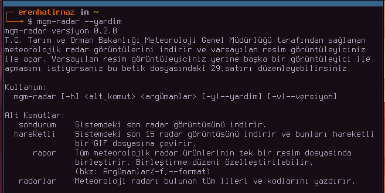
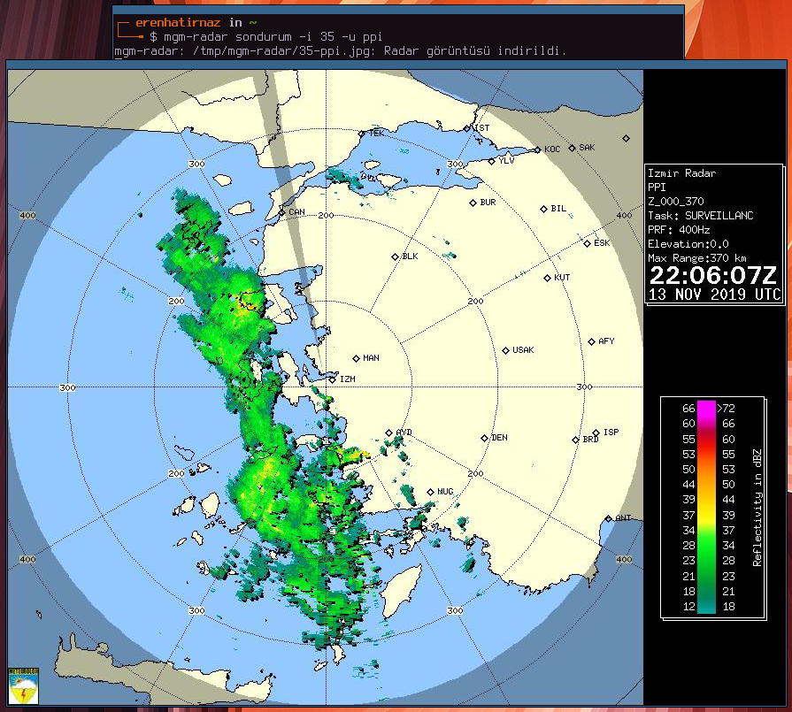
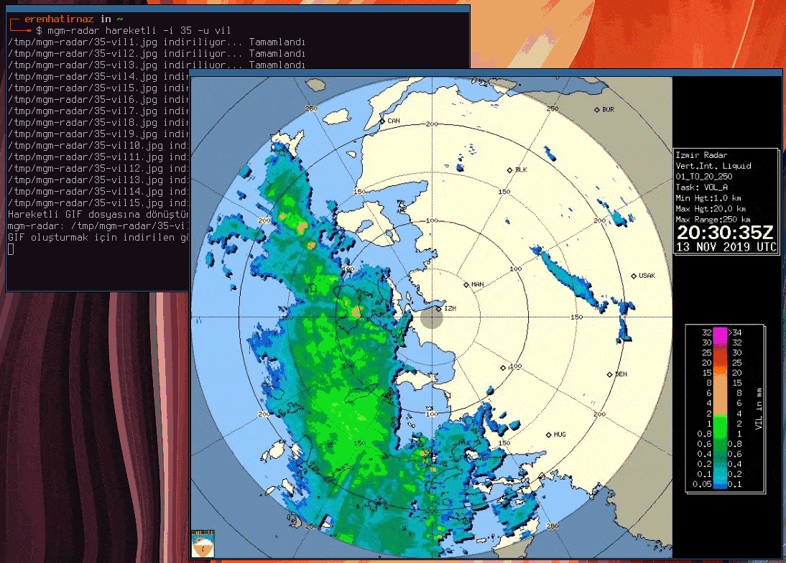
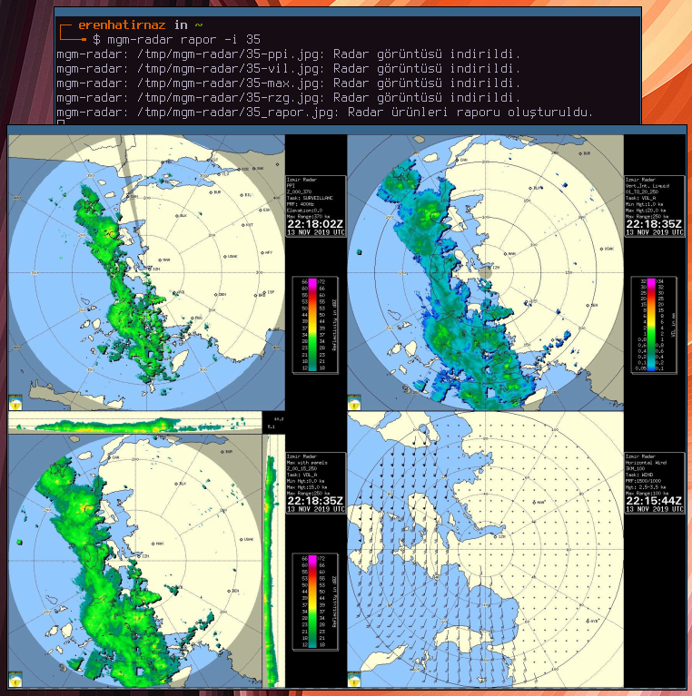

# 
[](https://travis-ci.org/erenhatirnaz/mgm-radar)
[](https://github.com/erenhatirnaz/mgm-radar/releases/latest)
[](https://github.com/erenhatirnaz/mgm-radar/blob/master/LICENSE)

> Meteorolojik radar görüntüsü indirme aracı

T.C. Tarım ve Orman Bakanlığı Meteoroloji Genel Müdürlüğü tarafından sağlanan
meteorolojik radar görüntülerini indiren ve varsayılan resim görüntüleyiciniz
ile açan bir araç. Varsayılan resim görüntüleyiciniz yerine başka bir resim
görüntüleyici ile açmak istiyorsanız `mgm-radar.sh` dosyasındaki 29.satırı
düzenleyebilirsiniz.

Bu betik, sadece GNU/Linux dağıtımlarında kullanılabilir. Windows sistemlerde
bash betiklerini çalıştırabilmek mümkünmüş fakat benim test etme imkanım olmadı.

[Bu betik ile ilgili detaylı blog yazısını için tıklayın.](https://wp.me/p14nDk-oF)
Ayrıca programlama alanında bilgili biri değilseniz ve bir sitede rastlayarak
buraya geldiyseniz de blog yazımdan devam etmenizi öneririm. Orada programlamadan
anlamayan kişiler için daha açıklayıcı olacak şekilde yazdım.

## Motivasyonum

Gün içerisinde birkaç kez bu radar görüntülerini kontrol ettiğim için hem kendime
kolaylık olması için, hem de insanların işine yarayabileceğini düşünerek böyle
bir betik kodladım. Ben gün içerisinde sıkça kullanıyorum.

## Kurulumu ve Kaldırılması

### Gereksinimler:
- Bash 4.0 veya üzeri (kontrol etmek için `bash --version`),
- `wget` - görüntüleri indirmek için (`sudo apt install wget`)
- `imagemagick` - hareketli gif oluşturmak için (`sudo apt install imagemagick`)

### Kurulum aşamaları:
```sh
$ git clone https://github.com/erenhatirnaz/mgm-radar.git
$ cd mgm-radar
$ chmod u+x ./mgm-radar.sh
$ make yukle
```

**NOT:** `make yukle` komutu bu depo içerisinde bulunan `mgm-radar.sh` dosyasının
sembolik bir bağlantısını (bir nevi kopyasını) `~/.local/bin/mgm-radar` konumuna
kaydeder ve böylece terminalizinde her yerden ulaşabilme olanağı sağlar. Eğer
siz kişisel betiklerinizi farklı bir dizinde saklıyorsanız
(mesela ben `~/scripts/` konumunu kullanıyorum), o zaman `Makefile` dosyası
içerisindeki 2.satırdaki `hedef` değişkenini düzenleyebilirsiniz.

### Kaldırmak için:
```sh
$ make kaldir
```
komutunu çalıştırabilirsiniz. Fakat unutmayın bu komut sadece `make yukle` komutu
ile oluşturulan sembolik bağlantıyı siler. İndirdiğiniz depo bilgisayarınızda
saklanmaya devam eder. Depoyu silmek size kalmış.

## Kullanımı

Meteorolojik radar bulunan illeri ve kodlarını öğrenmek için `mgm-radar radarlar`
komutunu çalıştırabilirsiniz. Ayrıca `mgm-radar --yardim` komutu ile detaylı
bilgiler edinebilirsiniz.

Meteorolojik radarın son kaydettiği radar görüntüsünü indirmek ve görüntülemek
için:
```sh
$ mgm-radar sondurum --il-kodu 61 --urun vil
```

Meteorolojik radarın son kaydettiği 15 görüntüyü hareketli GIF olarak indirmek
ve görüntülemek için:
```sh
$ mgm-radar hareketli --il-kodu 61 --urun ppi
```

Tüm meteorolojik radar ürünlerini indirip, bunları tek bir görselde
birleştirmek için:
```sh
$ mgm-radar rapor -i 55
```

`rapor` alt komutu görüntüleri varsayılan olarak kare (2x2) şeklinde
birleştirir. Eğer farklı formatlarda birleştirme yapmak istiyorsanız:
her satırda bir görüntü için `-f dikey`, bir satırda tüm görüntüleri
birleştirmek için `-f yatay` argümanlarını kullanabilirsiniz.

Radar görüntüleri varsayılan olarak `/tmp/mgm-radar/` konumuna indirilir. Burası
geçiçi bir dizidir ve bilgisayarınızı kapattığınızda silinir. Kalıcı olarak başka
bir dizine indirmek için, kısa şekliyle `-d`, uzun şekliyle `--dizin`
parametresini kullanabilirsiniz. Örnek:
```sh
$ mgm-radar sondurum -i 34 -u maks -d ~/Resimler/radar/
```
**Bu parametre ile verdiğiniz dizinin sizin tarafınızdan oluşturulmuş olması
gerekir.**

Radar görüntüsünü sadece indirmek istiyorsanız, `-s` ya da `--sadece-indir`
argümanını kullanabilirsiniz:
```sh
$ mgm-radar sondurum -i 6 -u ppi --sadece-indir
```
Bu sayede radar görüntüsü varsayılan dizine ya da sizin istediğiniz dizine
indirilir fakat varsayılan resim görüntüleyiciniz çalıştırılmaz.

**NOT:** Birleştirilmiş görüntü için mgm.gov.tr sadece PPI ürünü sunmaktadır.

## Test Edilmesi
Betiğin tüm fonksiyonlarını test etmek için `make test` komutunu
çalıştırabilirsiniz.

## Ekran Görüntüleri





## Lisansı

GNU Genel Kamu Lisansı versiyon 3

Copyright (C) 2019 Eren Hatırnaz <erenhatirnaz@hotmail.com.tr> [GPG: 0x8e64942a]

Bu bir özgür yazılımdır, ve bazı koşullar altında yeniden dağıtmakta
serbestsiniz; ayrıntılar için LICENSE dosyasına bakın.

Bu programın KESİNLİKLE HİÇBİR TEMİNATI YOKTUR; ayrıntılar için LICENSE
dosyasına bakın.
